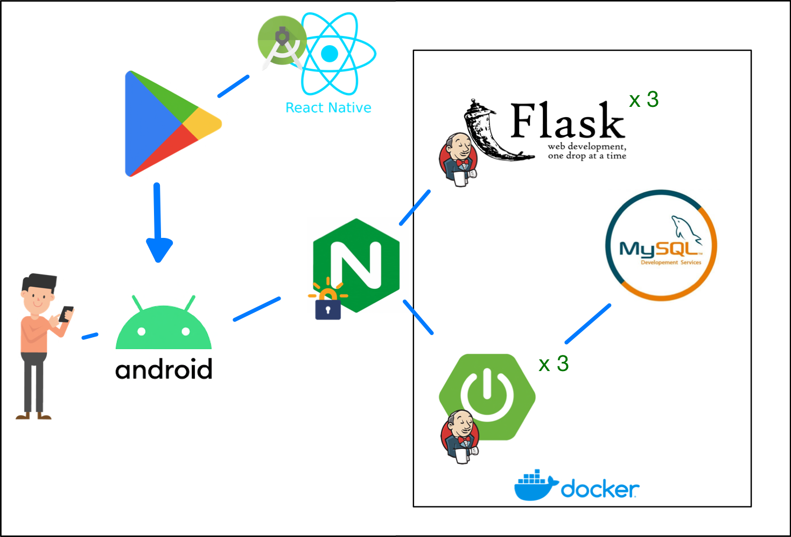

# 바:구니 배포 README


## 배포 구조




- 어플리케이션은 구글 플레이스토어에 등록해 배포한다.
- 서버는 EC2에 도커를 통해 스프링, 플라스크, mySQL 서버를 각각 3개, 3개, 1개씩 띄워두고 Nginx를 통해 연결하였다.
- 스프링, 플라스크 배포 과정에는 젠킨스를 활용했다.

## Jenkins

- EC2 서버 상에 Docker 컨테이너로 띄워두었다.

- `docker run --name jenkins1 -d -p 9000:8080 -p 50000:50000 -v jenkins_data:/var/jenkins_home -v /var/run/docker.sock:/var/run/docker.sock -v /usr/bin/docker:/usr/bin/docker jenkins/jenkins:lts`의 명령어를 통해 실행시켰다.

- 젠킨스의 최신 lts버전 이미지인 `jenkins/jenkins:lts`를 실행시켰고, 젠킨스 컨테이너를 재실행해야하는 상황이 일어나도 기존 데이터는 보존되도록 `-v jenkins_data:/var/jenkins_home`로 도커 볼륨에 볼륨 설정을 하였다. 그리고 DooD(Docker out of Docker)로 젠킨스 컨테이너 내에서 외부 도커에 접근할 수 있도록 `-v /var/run/docker.sock:/var/run/docker.sock`으로 볼륨 설정해두었고, 젠킨스 내부에 도커를 따로 설치하지 않기 위해 `-v /usr/bin/docker:/usr/bin/docker`로 외부의 도커를 불러왔다.

- 아래 그림처럼 GitLab 저장소의 develop 브랜치를 소스코드로 하였다.

  

- 빌드 트리거는 `Accepted Merge Request Events`만 활성화 시켜뒀다. 깃랩에서 develop 브랜치로의 직접 푸쉬를 막아뒀기에 MR이 수용됐을 때만 develop 브랜치에 변화가 생기기 때문이다.

- 추가로 불필요한 빌드를 막기 위해 아래 그림처럼 `DeployBE`라는 라벨이 들어갈 때만 빌드가 진행되도록 했다.

- 빌드 과정은 다음과 같다. `스프링1, 플라스크1 서버 삭제` - `스프링 Jar로 빌드` - `스프링, 플라스크 이미지 빌드 및 스프링1, 플라스크1 run` - `스프링2,3, 플라스크2,3 서버 삭제 및 새 이미지로 run` - `잔여 이미지 삭제`

- 젠킨스가 빌드를 진행할 때도 서버는 끊기지 않도록 하기 위해 어떤 타이밍에도 최소한 한 개의 서버는 돌아가고 있도록 했다. 이를 위해서 스프링1, 플라스크1을 run시킨 뒤 20초 간 sleep을 시켰다.

- Jar파일 빌드는 젠킨스에서 제공하는 gradle 플러그인을 사용했다. 기존 파일 삭제를 위해 `clean \n bootJar`를 넣어줬다.

- 모든 빌드가 끝난 뒤 `docker rmi $(docker images -f "dangling=true" -q)`를 통해서 사용되지 않는 이미지를 모두 삭제하도록 했다.

- 세부적인 서버 실행 명령어 등은 Dockerize쪽에서 설명한다.

## Dockerize

#### Spring

- 환경 - Java : corrento-11.0.15, SprintBoot : 2.6.7, 빌드 툴 : Gradle

- DockerFile

  ```dockerfile
  FROM openjdk:11-jdk
  ARG JAR_FILE=build/libs/barguni-0.0.1-SNAPSHOT.jar
  COPY ${JAR_FILE} barguni-0.0.1-SNAPSHOT.jar
  ENTRYPOINT ["java","-jar","barguni-0.0.1-SNAPSHOT.jar"]
  ```

  - 동일한 버전의 openjdk 자바가 설치되어 있는 이미지에서 실행한다.
  - 빌드되어있는 jar 파일을 가져와서 java로 실행한다.

- 실행 명령어는 `docker run --name back_barguni -d -p 8000:8000 -v /home/ubuntu/images:/images back_barguni`이다.

  - 3개의 서버가 각각 외부의 8000, 8001, 8002에 연동된다.
  - 나눠진 서버 어떤 곳에서도 같은 이미지에 접속할 수 있어야하므로 볼륨을 통해 이미지 폴더를 공유한다.


#### Flask

- 환경 - Python : 3.9, Flask : 2.0.3 

- DockerFile

  ```dockerfile
  FROM ubuntu:20.04
  ARG DEBIAN_FRONTEND=noninteractive
  RUN apt-get update \
      && apt-get install tesseract-ocr -y \
      python3 \
      #python-setuptools \
      python3-pip \
      && apt-get clean \
      && apt-get autoremove \
      && apt-get install git -y
  
  ADD . /home/App
  WORKDIR /home/App
  COPY requirements.txt ./
  COPY . .
  COPY /train/kor.traineddata /usr/share/tesseract-ocr/4.00/tessdata/
  
  RUN pip3 install -r requirements.txt
  
  VOLUME ["/data"]
  CMD ["python3","app.py"]
  ```

  - 그냥 python이미지에서 시작해도 됐으나, 테서랙트 프로그램과의 호환성을 고려해 ubuntu 20.04 이미지에 python3를 설치하여 진행했다.
  - 한글 학습데이터는 flask 프로젝트 내부가 아닌 테서랙트가 설치된 경로의 tessdata쪽에 들어가야 하기에 빌드 과정에서 제자리에 복사했다.

- 실행 명령어는 `docker run --name flask_barguni3 -d -p 5003:5001 -v /home/ubuntu/textfusenet/:/home/App/out_dir_r101/ctw1500_model/ flask_barguni`로 문자 인식 프로그램인 TextFuseNet을 볼륨으로 설정했다.

## Nginx

- Nginx는 EC2 자체에만 설치했다.

- `/etc/nginx/sites-available/default`에 작성한 nginx config 파일

  ```nginx
  ##
  # You should look at the following URL's in order to grasp a solid understanding
  # of Nginx configuration files in order to fully unleash the power of Nginx.
  # https://www.nginx.com/resources/wiki/start/
  # https://www.nginx.com/resources/wiki/start/topics/tutorials/config_pitfalls/
  # https://wiki.debian.org/Nginx/DirectoryStructure
  #
  # In most cases, administrators will remove this file from sites-enabled/ and
  # leave it as reference inside of sites-available where it will continue to be
  # updated by the nginx packaging team.
  #
  # This file will automatically load configuration files provided by other
  # applications, such as Drupal or Wordpress. These applications will be made
  # available underneath a path with that package name, such as /drupal8.
  #
  # Please see /usr/share/doc/nginx-doc/examples/ for more detailed examples.
  ##
  
  # Default server configuration
  # 메인 도메인 80,443 - 9000(일단 젠킨스로 연결해놓음)
  server {
          listen 80 default_server;
          listen [::]:80 default_server;
  
          # SSL configuration
          #
           listen 443 ssl default_server;
           listen [::]:443 ssl default_server;
          #
          # Note: You should disable gzip for SSL traffic.
          # See: https://bugs.debian.org/773332
          #
          # Read up on ssl_ciphers to ensure a secure configuration.
          # See: https://bugs.debian.org/765782
          #
          # Self signed certs generated by the ssl-cert package
          # Don't use them in a production server!
          #
          # include snippets/snakeoil.conf;
  
          ssl_certificate /etc/letsencrypt/live/k6b202.p.ssafy.io/fullchain.pem; # managed by Certbot
          ssl_certificate_key /etc/letsencrypt/live/k6b202.p.ssafy.io/privkey.pem; # managed by Certbot
          include /etc/letsencrypt/options-ssl-nginx.conf; # managed by Certbot
          ssl_dhparam /etc/letsencrypt/ssl-dhparams.pem; # managed by Certbot
  
  
          root /var/www/html;
  
          #Add index.php to the list if you are using PHP
          #index index.html index.htm index.nginx-debian.html;
  
          server_name k6b202.p.ssafy.io;
  
          location / {
                  # First attempt to serve request as file, then
                  # as directory, then fall back to displaying a 404.
  
                  proxy_pass http://localhost:9000;
                  proxy_http_version 1.1;
                  proxy_set_header Upgrade $http_upgrade;
                  proxy_set_header Connection "upgrade";
  
                  proxy_set_header X-Real_IP $remote_addr;
                  proxy_set_header X-Fowarded-For $proxy_add_x_forwarded_for;
  
                  #try_files $uri $uri/ =404;
          }
  }
  
  # 젠킨스 기본 9090-9000
  server {
          #listen 9090;
          listen 9090 ssl;
  
          ssl_certificate /etc/letsencrypt/live/k6b202.p.ssafy.io/fullchain.pem; # managed by Certbot
          ssl_certificate_key /etc/letsencrypt/live/k6b202.p.ssafy.io/privkey.pem; # managed by Certbot
          include /etc/letsencrypt/options-ssl-nginx.conf; # managed by Certbot
          ssl_dhparam /etc/letsencrypt/ssl-dhparams.pem; # managed by Certbot
  
          location / {
                  proxy_pass http://localhost:9000;
          }
  }
  
  # 스프링 서버 8080-8000,1,2
  upstream spring_servers {
          server localhost:8000;
          server localhost:8001;
          server localhost:8002;
  
          server localhost:8003;
  }
  
  server {
          listen 8080 ssl;
  
          ssl_certificate /etc/letsencrypt/live/k6b202.p.ssafy.io/fullchain.pem; # managed by Certbot
          ssl_certificate_key /etc/letsencrypt/live/k6b202.p.ssafy.io/privkey.pem; # managed by Certbot
          include /etc/letsencrypt/options-ssl-nginx.conf; # managed by Certbot
          ssl_dhparam /etc/letsencrypt/ssl-dhparams.pem; # managed by Certbot
  
          #location /images {
          #  alias /home/ubuntu/images;
          #}
          location / {
                  proxy_pass http://spring_servers;
                  proxy_set_header Host $host;
          }
  }
  # 플라스크 서버 5000-5001,2,3
  upstream flask_servers {
          server localhost:5001;
          server localhost:5002;
          server localhost:5003;
  }
  server {
          listen 5000 ssl;
  
          ssl_certificate /etc/letsencrypt/live/k6b202.p.ssafy.io/fullchain.pem; # managed by Certbot
          ssl_certificate_key /etc/letsencrypt/live/k6b202.p.ssafy.io/privkey.pem; # managed by Certbot
          include /etc/letsencrypt/options-ssl-nginx.conf; # managed by Certbot
          ssl_dhparam /etc/letsencrypt/ssl-dhparams.pem; # managed by Certbot
  
          client_max_body_size 20M;
  
          location / {
                  proxy_pass http://flask_servers;
                  proxy_set_header Host $host;
          }
  }
  
  ```

  - certbot을 통해서 https 인증키를 받고 적용했다.
  - config 파일 아래 쪽에 작성한 적이 없는 내용들이 많이 작성돼있었는데, 확인해보니 이는 certbot으로 인증서를 발급해줄 때 옵션으로 nginx config파일을 일부 수정해주는 옵션 때문이었다. 해당 코드는 전부 지워도 위쪽에 ssl설정을 잘 해놓는다면 작동에 문제가 없다
  - 어플 서비스여서 프론트엔드 웹페이지가 없기에, 메인 도메인은 젠킨스로 연결시켜놨다.
  - 스프링 서버와 플라스크 서버들은 각각 upstream으로 묶어서 로드밸런싱을 해두었다.

## 기타 

### 메모리 스왑

- 테스트 과정에서 여러차례 메모리 초과로 EC2 서버가 터졌고, 이후에도 원인이 불분명하게 한 차례 서버가 터졌다. 

- 서버의 메모리 사용량을 실시간으로 계속 확인해보니, 램 16기가 중 평균적으로 7기가 정도를 사용하고 있었다.

- 여유가 없는 편은 아니었지만 안정성을 위해 저장 용량 중 일부를 스왑 메모리로 돌리기로 했다.

- 

  위를 참고해, 14GB를 스왑 메모리로 돌렸다.

- 설정 과정은 aws의 가이드를 그대로 따랐고,  용량을 14GBㄹ로 설정하기 위해 dd명령의 count만 112로 변경했다.

  - https://aws.amazon.com/ko/premiumsupport/knowledge-center/ec2-memory-swap-file/

