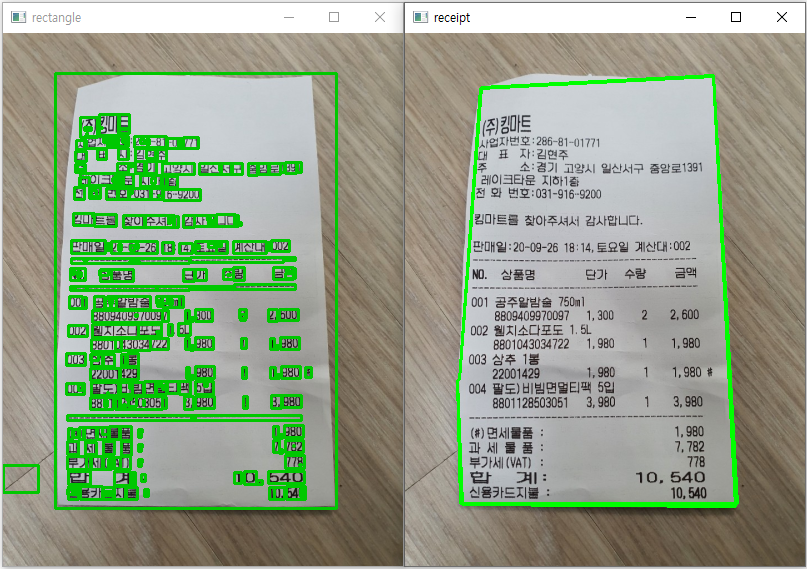
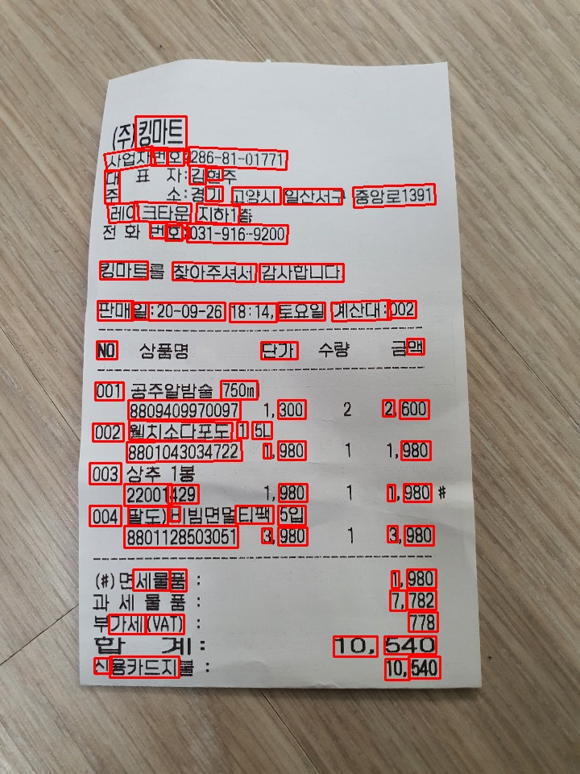

# 영수증 OCR 기능 개발 과정

## 기능 소개

```
이미지에서 문자 검출을 진행한 후, 검출된 영역마다 문자인식을 진행하고
인식된 문자를 필터링하여 영수증 내의 상품 정보를 반환한다.
```

## Text Detection

1.  opencv 이용

    ```
    아래 두 방식 모두 특정 조건의 이미지에서만 잘 동작하는 한계를 보였다.
    ```

    - 적절한 threshold 선정

      

    - 가장 큰 rectangle 갖는 contour 탐색

      

2.  Scene Text Detection 모델 이용

    - 모델 선정

      ```jsx
      Scene Text Detection 오픈소스로 현재 가장 우수하게 평가받고 있는 TextFuseNet과
      프로젝트에서 영수증 인식 API로 선정한 Clova 에서 오픈소스로 제공하는 Craft를 선정하여 비교를 진행했다.

      비교에는 TextFuseNet의 icdar2013, icdar2015, ctw1500, totaltext 모델 그리고
      Craft의 craft_mlt_25k.pth, craft_ic15_20k.pth 모델
      총 6개의 모델들을 준비한 영수증 이미지들을 이용해 테스트했다.

      테스트 결과 TextFuseNet의 ctw1500 모델이 검출하는 텍스트 영역의 범위가
      가장 적합하다고 판단하여 해당 모델을 선정하게 됐다.
      ```

    - TextFuseNet

      - icdar2013 / icdar2015

          <figure class="half">
            
            
          </figure>

      - ctw1500 / totaltext
          <figure class="half">
            
            
          </figure>

    - Craft
      - craft_mlt_25k / craft_ic15_20k
          <figure class="half">
            
            
          </figure>

    ## Text Recognition

    1.  모델 선정

        ```jsx
        Tesseract-OCR 과 EasyOCR 두 모델을 비교했다.
        Tesseract-OCR/tessdata_best의 kor.traineddata와
        EasyOCR의 korean_g2.pth, craft_mlt_25k.pth를
        준비한 영수증 사진들을 이용해 테스트를 진행하였다.
        테스트 결과 Tesseract-OCR의 텍스트 인식이 더 정확하다고 판단하여 해당 모델을 선정하게 됐다.
        ```

    2.  모델 학습

        ```
        Colab 개발 환경에서 단어 5000개, 글자 2000개의 손글씩 이미지 데이터로 학습을 진행하였다.
        Iteration을 10000, 20000, 30000 으로 증가시키며 총 3번의 학습을 진행했다.
        Iteration이 증가할 수 록 데이터에 대한 error rate는 감소하였지만 실제 결과는 나빠지는 오버피팅 현상이 발생하였고 학습을 중단하게 됐다.
        ```

    3.  시행착오

        - 제공받은 gpu 서버 권한 문제로 Tesseract-OCR을 설치할 수 없어 gpu 서버에서 학습을 진행할 수 없었다.

        - Window 환경의 노트북에서 Font 학습을 시도하였지만 아래와 같은 오류로 학습을 진행할 수 없었다.  
          이 오류는 Fine Tuning 시 기존 모델에 없는 글자가 학습할 데이터 셋에 존재하면 발생하는 오류였다.

          ```
            Can't encode transcription
          ```

        - JTessBoxEditor 로 Font 학습을 진행하였다.  
          하지만 성능이 크게 떨어져 Font 학습을 멈추는 계기가 됐다.

        - 무료 버전의 Colab 을 사용하여 학습을 진행하였다.  
          학습 시간이 길어지면 세션 연결이 끊어지고 환경이 초기화 됐다.  
          이로 인해 1차적으로 학습 데이터 양을 1/6로 줄여 학습을 진행했다.

        - 동일한 단어에 대한 다른 손글씨 이미지 데이터들이 있었다.  
          이로 인해 학습 데이터의 라벨링 파일 텍스트 값이 중복되는 문제가 발생하였다.  
          이 문제를 피하기 위해 다시 1/20로 학습 데이터를 줄였고  
          최종적으로 준비한 데이터의 1/120의 양으로 학습을 진행했다.

    ## Filtering

    ```jsx
      문자열이 카테고리에 해당하는 단어를 포함하고 있는지 검사하는 기능을 한다.
    ```

    - 카테고리 수집

      ```
        Selenium을 이용한 크롤링을 통해 쿠팡의 식품 카테고리의 세부 항목들을 수집하였다.
      ```

    - 자료구조

      ```
        Trie 구조를 사용하여 문자열 한 번 검사 시
        O(n) (n: 검사하는 문자열 길이) 내에
        필터링이 이루어 질 수 있도록 구현하였다.
      ```

        
