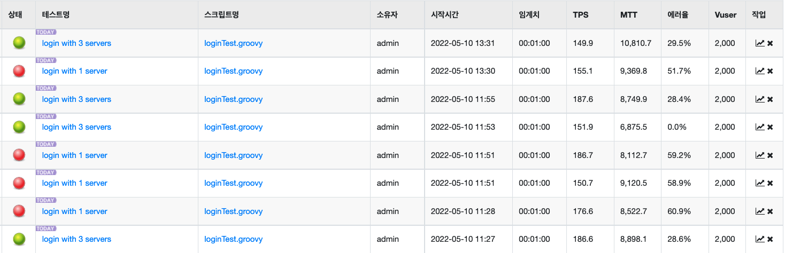
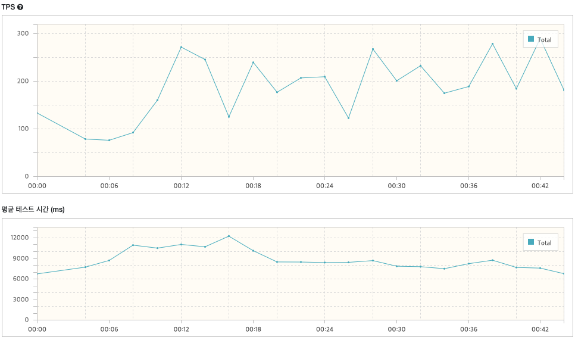

# Ngrinder 부하 테스트

## 개요

- Ngrinder 컨트롤러는 서비스가 배포된 Amazon EC2 서버에 설치
- Ngrinder **Agent**는 총 **2대**를 동시에 사용
  - 1대는 같은 EC2 서버에서 도커로 실행
  - 1대는 SSAFY 지급 노트북(`nt850xac x70b`)에서 실행
- 최소 **Vuser : 120**
  - 예상 일일 사용자를 5만으로 잡고 사용자 당 일일 요청 수를 20으로 잡으면, 하루에 들어오는 **총 요청은 100만**이다.
  - 1초당 요청 수를 구하기 위해 100만을 24 * 60 * 60(86400) 으로 나누면 **약 11.6이라는 평균 1초당 요청수**가 나온다.
  - 피크 시간대에는 요청이 5배라고 가정하면 58, 약 60이 나오고, 여유분과 극한의 상황을 가정하여 그 두 배까지 버텨야 한다고 생각하면, 최소 **Vuser는 120**이 된다.
  - 따라서 Vuser는 최소 120으로 잡고 테스트를 진행할 것이며, 에러없이 테스트를 통과하는 경우에는 테스트가 가능한 지점까지 Vuser를 늘려가며 진행할 것이다.

- 같은 환경에서 변수만 바꿔 여러차례 테스트를 진행했을 때의 **TPS**(Transaction per seconds, 초당 처리 수), **MTT**(Mean Test Time, 평균적으로 응답을 받기까지 걸린 시간), **에러율** 등을 기준으로 결과를 판단
- 모든 서버는 위의 EC2 서버 위에서 도커로 배포되었으며, DB역시 같은 방식으로 배포된 mySQL이다.

## 테스트 1 - 스프링 서버 분산 테스트

#### 개요

- **스프링 서버 1대**로 모든 요청을 처리할 때와, `Nginx`에서 소프트웨어 **로드밸런싱**으로 **스프링 서버 3대**에 요청을 나누어 처리할 때의 성능을 비교한다.
- 전자를 **상황1**, 후자를 **상황2**라고 하겠다.
- 상황2에서의 3대의 스프링 서버는 같은 ec2 서버 내에서 도커로 작동한다.
- 가상사용자(Vuser)는 프로세스당 1000명, 총 2000명으로 설정
- 요청은 로그인 요청(jwt토큰을 받아오는 POST 요청)으로 1분 간 진행
- 똑같은 테스트를 스프링 서버만 껐다 켜며 각각 4번씩 진행

#### 테스트 결과

- 상황1의 테스트 4회 모두 `Too many errors`라는 메세지와 함께 테스트가 도중에 종료되었다.

  - 4회의 테스트에서 각각 43초, 31초, 48초, 31초에 종료되었다.

- 상황2의 테스트 4회 모두 1분간의 테스트를 끝까지 완료했다.

- TPS와 MTT는 유의미한 차이가 없었으나, **에러율에서 뚜렷한 차이**를 보였다.

  - 상황1의 에러율은 최소 51.7%, 최대 60.9%였고, 상황2는 0%~29.5%의 에러율을 보였다.

  - 상황1의 테스트는 모두 아래와 같이 에러가 계속해서 증가하다가 너무 많은 에러로 테스트가 종료되었다.

    

    - 상황1 테스트 중 가장 오래(48초) 종료되지 않고 진행된 3번째 실험의 오류 그래프

  - 상황2에서는 아래처럼 비교적 안정적인(4회 중 최고값 300 이하) 오류 그래프가 나타났다.

    

    - 28.4%의 에러율이 나타난 상황2의 3번째 실험의 오류 그래프

- 평균적으로 상황1보다 상황2에서 TPS의 변동이 큰 경향이 있었으나, 상황1의 테스트는 오류로 더 일찍 종료되었기에 결론을 내리기는 힘들다.

  

  상황1의 3번째 실험의 TPS와 MTT그래프

  

  상황2의 3번째 실험의 TPS와 MTT그래프

#### 결론

- `Nginx`의 로드밸런싱을 사용하여 서버를 여러 대 띄워서 사용해도 한 대를 띄울 때와 **처리 속도의 차이는 없었다**. 같은 EC2 서버 내에서 처리하기 때문인지, 다른 서버에 스프링을 띄워도 결과가 같을 지는 알 수 없다.
- 반면 **에러율에서는 큰 차이**를 보인다. 같은 서버 내에서의 로드밸런싱이라도, 트래픽을 여러 대에서 나누어 처리할 때 훨씬 더 적은 에러율을 보인다.

## 테스트 2 - fetch join 테스트

#### 개요

- N+1 문제를 해결하기 위해 DB에서 아이템을 가져올 때 **fetch join**을 활용했다.
- 이 fetch join을 사용했을 때와 사용하지 않았을 때 어떤 차이가 있는지 테스트하고자 한다.
- 전자를 **상황1**, 후자를 **상황2**라고 하겠다.
- 백 서버는 EC2 위에 띄워진 스프링 서버 도커 컨테이너 3개에서 분산 처리한다.
- 상황1, 상황2로 바꾸어 테스트하기 위해서는 배포되어있는 코드를 변경해야하므로, 상황1에서 테스트를 쭉 진행하고, 이후 상황2의 코드로 변경하여 같은 테스트를 진행했다.
- 가상사용자(Vuser)는 최소 Vuser인 **120부터 순차적으로 늘려**본다.
- 요청은 일반적으로 가장 많이 사용될 요청이자 fetch join에 따른 영향이 가장 클 것으로 예상되는 **'바구니 내의 사용안 된 아이템 전체 가져오기'** 요청으로 했다.
- 요청을 보내는 바구니에는 아이템이 약 100개 들어있다.

#### 진행

- 아이템이 100개 들어있는 상태에서 Vuser를 순차적으로 늘려가며 테스트를 했지만 결과에 차이가 나지 않았다. 
- 컨설턴트님과 상담 결과, 일단 스프링 서버와 DB가 같은 EC2에 있으므로 DB에 다녀오는 비용이 크지 않아 차이가 상대적으로 적을 것이며, 아이템의 수가 적어서 일 수도 있고, 쿼리와 관계없는 부분에서 속도가 저하되면 병목 현상이 일어날 수 있다고 하셨다.
- 이를 확인하기 위해 일단은 기존 바구니에 아이템 가데이터를 **10000개** 추가했다.
  - 테스트를 돌리자 EC2 서버가 통째로 터졌다...
  - 몇 분간의 재부팅 후 Vuser를 대폭 줄여 다시 돌렸으나 또 터졌다...
  - 서버가 터진 건 문제지만 하나의 바구니에 아이템을 10000개 담고, 또 몇 백명의 유저가 계속해서 이 바구니를 전체 조회하는 것은 아주 극단적인 상황이므로, 일단 테스트를 진행하기로 했다.
- 아이템을 **1000개**로 줄이고 다시 테스트했다.
  - 정상적으로 테스트가 진행됐으나 역시 상황1과 상황2의 차이는 없었다.
- 컨테이너들의 **CPU 사용량**을 띄워놓고 다시 테스트를 진행했다.
  - mySQL의 CPU 점유율은 계속해서 안정적이었으나 스프링 서버 3대의 CPU 점유율이 모두 100% 가까이 치솟았다.
  - 이를 통해 속도 저하와 에러는 DB와 관계없이 스프링 서버 자체에서 한 번에 큰 데이터를 여럿을 처리하면서 생긴 문제임을 알 수 있었다.
  - 이를 해결하기 위해 스프링 **서버를 3대 추가**했다. 다시 진행하니 각각의 CPU 점유율이 60% 정도에서 안정되는 것을 확인할 수 있었다.
- 이 상태에서 다시 CPU 점유율을 모니터링하며 테스트를 진행했으나 또 터졌다...
  - 총 3번 터졌는데, 터졌을 때보다 더 부하가 큰 테스트를 진행할 때도 테스트 오류가 났지 EC2 서버가 통째로 재부팅 되지는 않았다. 
  - 3번 모두 `docker container stats`명령어를 통해 컨테이너들의 CPU 모니터링을 진행하던 도중이었다.
  - 그래서 CPU 모니터링만 안하면 될 줄 알았는데 또 터졌다. 테스트는 중지해야겠다.

#### 결론

- fetch join을 사용하는게 이점이 있다고 하더라도, 현재 배포 환경처럼
  1. 백(스프링) 서버에서 병목 현상이 일어나면 쿼리문에 관계없이 속도가 저하될 수 있다.
  2. 백 서버와 DB 서버가 같은 EC2 환경 안에서 실행되고 있으면, 다른 서버에 있는 것보다 쿼리문을 날리는데 필요한 비용이 적어 큰 차이가 나지 않을 수 있다.
  3. 아이템의 수가 늘어나도 하나의 쿼리문이 아이템들의 리스트로 가져오기 때문에 DB의 부담의 증가폭은 그렇게 크지 않지만, 스프링 서버에서는 `늘어난 아이템 수 * 아이템 당 응답에 필요한 스텝 수`만큼 늘어난다. 
- 따라서 현재같은 배포 상황에서는 쿼리문 보다는 java에서 돌아가는 로직을 최적화하는 것이 더 효율적이라는 결론에 도달했다.
