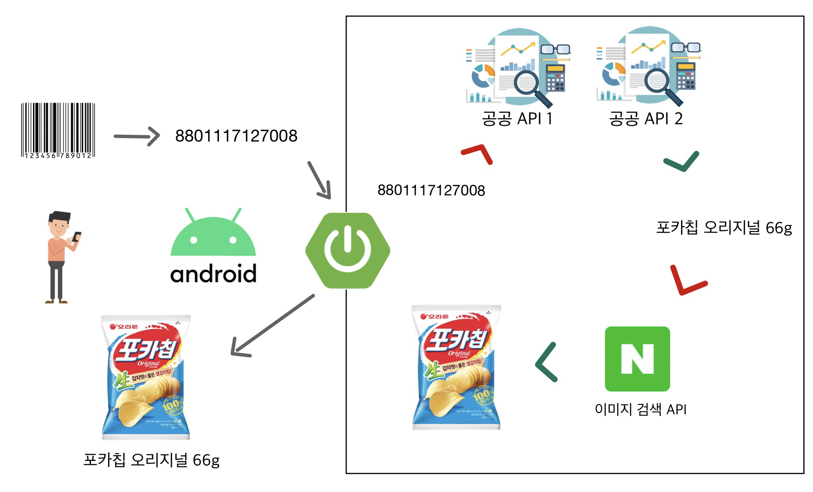

# 바:구니 바코드 README

[바코드 인식 구조](#바코드-인식-구조)
[사용 데이터셋](#사용-데이터-셋)
[이미지 크롤링](#이미지-크롤링)

## 바코드 인식 구조

- 사용자가 어플을 통해 바코드를 촬영하면 해당 상품의 정보를 가져온다.
- 바코드 인식은 안드로이드 라이브러리를 활용했다.
- 바코드의 코드를 식품의약품안전처가 제공하는 '바코드연계제품정보'와 '유통바코드' 두 개의 공공데이터API에서 찾아 상품의 기본 정보를 가져온다.
- 위 공공API에서 상품의 이미지는 제공하지 않기에, 네이버 이미지 검색 API를 통해 이미지를 크롤링한다.

## 사용 데이터 셋

- 바코드의 숫자 코드를 통해 상품을 찾을 때 사용한 **데이터셋에 대한 설명**이다.
- 무료로 개방되어있는 데이터셋 중 바코드로 상품을 특정할 수 있는 데이터셋은 **식품의약품안전처**가 제공하는 두가지 공공API(바코드연계제품정보, 유통바코드)가 있었다.
- 두 데이터셋 모두 시중에 유통되는 **모든 상품의 데이터를 가지고 있지는 않았다.** 국내 대기업이 유통하는 상품(신라면, 촉촉한 초코칩, 불닭볶음면, 펩시콜라 등)은 대부분 있었으나 그외의 제품군에서는 없는 경우가 제법 있었다.
- 국내에 유통되는 **모든 상품의 바코드 정보를 제공하는 데이터셋**이 존재했다. 유통물류진흥원에서 제공하는 '바코드 정보 제휴' 서비스를 가입하면 사용할 수 있었는데, 한달 이용료가 120만원으로 사비로도 싸피로도 감당이 안 될 듯 싶어 사용을 포기했다. 바:구니 서비스가 실제 사업으로 연계된다면 사용을 고려할 수 있겠다.
- 두 공공 데이터셋의 내용이 겹치지 않는것 같았기에 '바코드연계제품정보'에서 데이터를 찾지 못하면 '유통바코드'에서 다시 한 번 찾아보도록 만들었다.

## 이미지 크롤링

- 처음 고려했던 이미지 검색 API는 구글, 네이버, 카카오의 3가지였다.
- 사용한 데이터셋이 국내의 일부 제품만을 인식했기에, 구글보다는 네이버와 카카오가 더 적합하다고 생각했고, 카카오(다음)보다는 네이버의 데이터양이 많을거라고 추측하여 네이버 API를 선택했다.
- 단순히 이미지를 사용자에게 전달하기만 해도 됐지만, 그럴 경우 같은 바코드로 여러번 조회할 때마다 크롤링을 또 진행해야하기에 비효율적이었다. 따라서 기성제품(Product) 테이블을 만들어 누군가 한 번 조회했던 바코드의 제품 정보는 저장하도록 했다.
- 이미지를 저장할 때 단순히 파일로 저장하고 제품 테이블에서 이미지의 url을 가지고 있기만 해도 구현은 가능하지만, 이미지에 대한 정보를 db에서 관리하면 편할 것이라고 생각하여 이미지 역시 하나의 테이블로 관리했다.