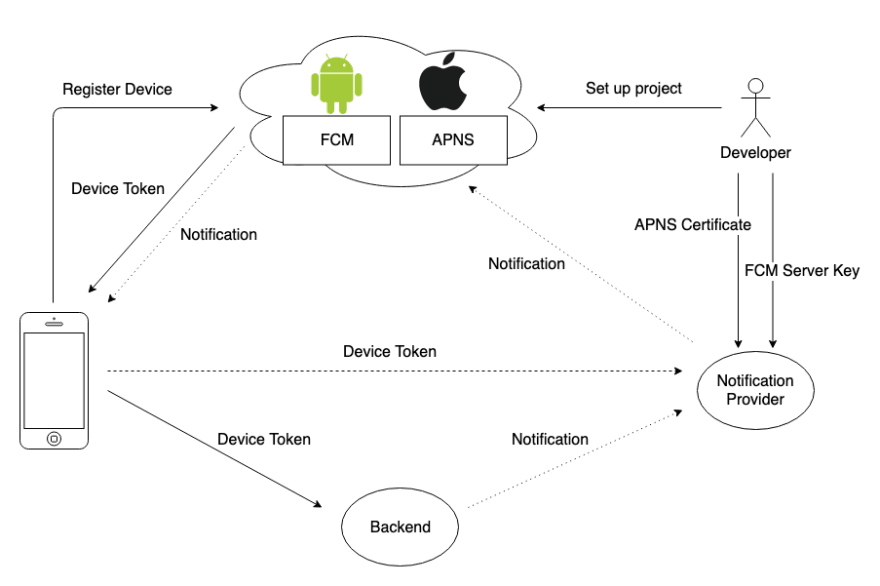

# Firebase

### **Architecture**



## 바구니 프로젝트 적용

안드로이드 앱에 Firebase 적용은 [Firebase](https://console.firebase.google.com/) 에서 프로젝트 생성 시 나오는 메뉴얼을 따라하면 됨

## Device → Backend

- FrontEnd Code (AppInner.tsx)

```jsx
useEffect(() => {
// 로그인 후 Device Token 전송
    async function sendToken() {
      try {
        if (!messaging().isDeviceRegisteredForRemoteMessages) {
          await messaging().registerDeviceForRemoteMessages();
        }
        const token = await messaging().getToken();
        console.log('phone token', token);
        const res = await sendFCMKey(token); // Backend 서버에 전송
      } catch (error) {
        console.error(error);
      }
    }
    sendToken();
  }, []);
```

- channeld를 맞춰야 전송을 받을 수 있음 (App.tsx)

```jsx

const createChannels = () => {
    PushNotification.createChannel(
      {
        channelId: 'fcm_fallback_notification_channel',
        channelName: 'fcm_fallback_notification_channel',
      },
      () => {
        console.log('channelCreate');
      },
    );
  };

  useEffect(() => {
    createChannels();
  }, []);
```

## Backend Setting

```jsx
{
  "type": "service_account",
  "project_id": "등록한 프로젝트 id",
  "private_key_id": "프라이빗 키 아이디",
  "private_key": "프라이빗 키",
  "client_email": "firebase-adminsdk-agp0f@barguni-a7494.iam.gserviceaccount.com",
  "client_id": "클라이언트 아이디",
  "auth_uri": "https://accounts.google.com/o/oauth2/auth",
  "token_uri": "https://oauth2.googleapis.com/token",
  "auth_provider_x509_cert_url": "https://www.googleapis.com/oauth2/v1/certs",
  "client_x509_cert_url": "발급받은 url"
} // Firebase 설정

```

## Backend에서 접근할 AccessToken 받아오는 code

```jsx
private String getAccessToken() throws IOException {
        String firebaseConfigPath = "firebase_service_key.json";

        GoogleCredentials googleCredentials = GoogleCredentials
                .fromStream(new ClassPathResource(firebaseConfigPath).getInputStream())
                .createScoped(List.of("https://www.googleapis.com/auth/cloud-platform%22));

        googleCredentials.refreshIfExpired();
        return googleCredentials.getAccessToken().getTokenValue();
    }
```

## Backend 알림 생성 code

```jsx
public void sendMessageTo(String targetToken, String title, String body) throws IOException {
        String message = makeMessage(targetToken, title, body);

        OkHttpClient client = new OkHttpClient();
        RequestBody requestBody = RequestBody.create(message,
                MediaType.get("application/json; charset=utf-8"));
        Request request = new Request.Builder()
                .url(API_URL)
                .post(requestBody)
                .addHeader(HttpHeaders.AUTHORIZATION, "Bearer " + getAccessToken())
                .addHeader(HttpHeaders.CONTENT_TYPE, "application/json; UTF-8")
                .build();

        Response response = client.newCall(request).execute();

        System.out.println(response.body().string());
    }
```