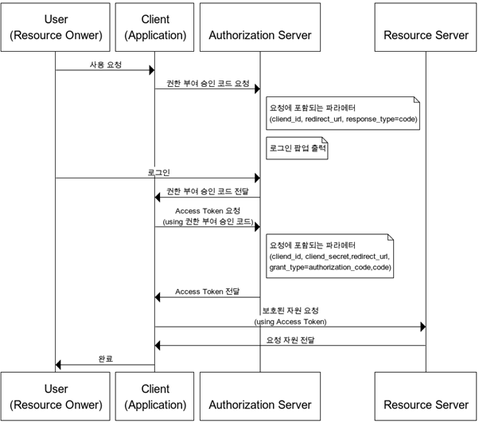

# Oauth

### Oauth 적용



### FrontEnd Code

```jsx
// react-kakaosdk를 사용해 로그인 요청 후 승인코드를 가져옴
const res = (await KakaoSDK.login()) as AccessTokenType;
// 서버에 Token 요청
const data = await login(SocialType.KAKAO, res.access_token); 
// 발급받은 토큰을 스토리지에 저장
await EncryptedStorage.setItem('refreshToken', data.refreshToken);
await EncryptedStorage.setItem('accessToken', data.accessToken);
setJwtToken(data.accessToken); // API Instance 사용을 위한 저장

// instance.st
function setJwtToken(token: string) {
  jwtToken = token;
}

function LoginApiInstance(): AxiosInstance {
  const instance = axios.create({
    baseURL: Config.API_URL,
    headers: {
      'Content-type': 'application/json',
      Authorization: `Bearer ${jwtToken}`, // 보호된 자원 요청 accessToken 사용
    },
  });
}
```

## Back Server Code

```java
/**
 * Social Login API Server 요청에 의한 callback 을 처리
 * @param socialLoginType: (GOOGLE, KAKAO)
 * @param code: Client 로부터 넘어오는 인가 code
 * @return SNS Login 요청 결과로 받은 Json 형태의 String 문자열 (access_token, refresh_token 등)
 */
@GetMapping("/oauth-login/{socialLoginType}/callback")
@Operation(summary = "SNS 로그인", description = "인가 코드로 엑세스 토큰을 얻고 정보로 로그인한다.")
public ResponseEntity<ResVO<TokenRes>> snsLogin(
        @PathVariable(name = "socialLoginType") SocialLoginType socialLoginType,
        @RequestParam(name = "code") String code) throws Exception {

    ResVO<TokenRes> result = new ResVO<>();
    HttpStatus status = null;

		// Access Token 요청
    ResponseEntity<String> responseToken = oauthService.requestAccessToken(socialLoginType, code);
    if(responseToken == null) throw new OauthException(new ErrorResVO(ErrorCode.OAUTH_INVALID_AUTHORIZATION_CODE));
    ObjectMapper objectMapper = new ObjectMapper();
    OauthToken oauthToken = null;
    oauthToken = objectMapper.readValue(responseToken.getBody(), OauthToken.class);

    // 이메일 정보(서비스 필수 정보) 제공을 동의할 때까지 리다이렉트
    if(!oauthToken.getScope().contains("email")) {
        oauthService.request(socialLoginType);
        throw new OauthException(new ErrorResVO(ErrorCode.OAUTH_EMAIL_NOT_ALLOWED));
    }

    // 사용자 Profile 정보 요청
    ResponseEntity<String> responseProfile = oauthService.getProfile(socialLoginType, oauthToken);
    if(responseProfile == null) throw new OauthException(new ErrorResVO(ErrorCode.OAUTH_INVALID_ACCESS_TOKEN));
    OauthProfileinfo emailAndName = oauthService.getEmailAndName(socialLoginType, responseProfile.getBody());
    

		// 사용자 회원가입 or 로그인
		Boolean duplicated = userService.isDuplicated(emailAndName.getEmail());
    User user = null;
    if(!duplicated) {
        user = userService.oauthSignup(emailAndName);
    }
    else{
        user = userService.findByEmail(emailAndName.getEmail());
    }

		// 서버의 Access Token & Refresh Token 발급
    status = HttpStatus.OK;
    String accessToken = JwtTokenUtil.getToken(user.getId().toString(), TokenType.ACCESS);
    String refreshToken = JwtTokenUtil.getToken(user.getId().toString(), TokenType.REFRESH);
    TokenRes tokenRes = new TokenRes(accessToken, refreshToken);
    result.setData(tokenRes);

    result.setMessage("SNS 로그인 성공");

    return new ResponseEntity<ResVO<TokenRes>>(result, status);
}
```